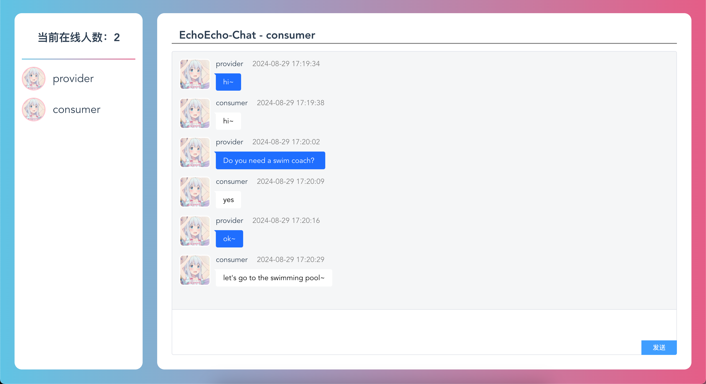

# I. Project Overview
Welcome to EchoEcho—offline services at your fingertips! By integrating NFTs and zero-knowledge proofs, we have created a vibrant world of services for you. Here, service providers can turn their skills into unique NFTs and update their coordinates. With just a simple tap on the interface, you can discover nearby service treasures, whether it’s a fitness coach, cultural tour guide, or offline companionship, we’ve got it all!

Service providers can easily issue their first service NFT and set enticing trial policies. Plus, users don’t need to worry about privacy—our platform verifies the viability of services without disclosing users' exact locations. All transactions are managed through our secure smart contracts, making refunds straightforward if you decide to withdraw during the trial period.

Use EchoEcho to enjoy unprecedented flexibility and security. Let’s redefine personalized service experiences with blockchain technology together!

# II. Technology Stack
- `Smart Contract`: `Solidity`
- `Frontend`: `Next.js`
- `zk Proof`: `Circom + Snark.js`

# III. Process Details
1. **NFTMarket Platform Fees and Trial Policies**
   - **Fees**: NFTMarket platform charges a 1% fee on each NFT transaction.
   - **Trial Length and Costs**: When `providers` list their NFTs, they need to specify a trial price percentage (`trialPriceBP`) and trial duration percentage (`trialDurationBP`). This means a `consumer` can cancel during the trial period and only pay the trial price.

2. **NFT Issuance and Listing (list_offline_service)**
   - **Issuing NFTs**:
     - Maria, a student majoring in history, is passionate about Italian historical landmarks and cultural sites. Combining her art history background and fluency in Italian, English, and Hindi, she can offer unique experiences that blend learning with leisure, making each trip unforgettable. Thus, she can upload the IPFS CID of [Maria.json](https://github.com/TheEchoEcho/EchoEcho_contract/blob/main/IPFS_files/jsons/Maria_cultural_tour_guide.json) to mint a new NFT.
     - Sophia, an entertainment companion, excels in both board and role-playing games, providing exquisite game strategies and experiences. She can upload the IPFS CID of [Sophias.json](https://github.com/TheEchoEcho/EchoEcho_contract/blob/main/IPFS_files/jsons/Sophia_board&role-playing_game_companion.json) to mint a new NFT.
     - Alice, an experienced personal fitness trainer, wants to offer her services without geographical constraints. Whenever she visits a new city or country, she can provide local personal training services by uploading the IPFS CID of [Alice.json](https://github.com/TheEchoEcho/EchoEcho_contract/blob/main/IPFS_files/jsons/Alice_personal_fitness_trainer.json) to mint a new NFT. 
   - **Pricing and Terms of Service**: Minted NFTs can be listed on the market with necessary information:
     - Price: Cost of one service session (unit: ETH)
     - Trial Price BP: Trial price (`5000 trial price basis points = 50% of the (price - fee)`)
     - Max Duration: Duration of one service session (unit: hours)
     - Trial Duration BP: Trial duration (`5000 trial duration basis points = 50% of the max duration`)
     - List End Time: Listing duration (if Alice is staying in a new city for a month, this can be set to one month)
     - 
     - The market displays the NFT: 

3. **Provider's Location Disclosure and User Search**
   - **Location Disclosure**: Alice needs to disclose her geographical location on the platform when taking orders, enabling users to search for her based on distance.
   - **User Search**: User Bob, looking for a personal trainer, can set search criteria such as distance and type of personal training to find suitable service providers.

4. **Three States Before Confirming an Order**
   - **Consumer -> `I Want`**: After finding Alice’s listed NFT, Bob can click `I Want`. The platform generates a `distance proof` based on Bob's location locally, allowing Alice to know their distance without knowing Bob's exact location and verify this distance with the `distance proof`.
   - **Provider -> `Agree`**: If Alice feels the distance is manageable, she can click `agree` and enter `EchoEcho-chat` to chat with Bob: 
   - **Consumer -> `Buy Now`**: Once Alice agrees, Bob can click `Buy Now`, and he can see the service he has purchased in Services. 

5. **Service Execution and Money Escrow**
   - **Buying the NFT**: After Bob purchases Alice’s service, the paid ETH is held in escrow by the platform's smart contract.
   - **Withdrawal**: Alice can only withdraw the funds if she does not provide the service, to prevent Bob from cancelling the order during the trial period.

## 3.2 Other
### 3.2.1 `zk proof` Generation Process
- Before purchasing Alice’s service, Bob needs to provide a proof to Alice that he is within the service delivery range. The proof and verification process are as follows:
- $Prove(coord_1, coord_2, sig, pk, distance) -> \pi$ . Here, coord_2 is the user's current coordinates, and coord_1 is the service’s listed coordinates. This proof shows that coord_2 is within the distance from coord_1, and it is signed by the project’s authority.
- $Verify(\pi, coord_1, sig, pk, distance) -> 1/0$ . An output of 1 indicates that the verification is successful, confirming the buyer is within the service range.
- Due to the high cost of on-chain verification and its non-essential nature in the process outlined above, the verification is performed off-chain.

### 3.2.2 Cancel Order
- Bob can cancel the order during the trial period, and the platform will refund part of the money to Bob (`amount = TrialPriceBP * (Price - fee)`), while Alice receives `Price - amount`.

### Chat

# IV. Project Team
- DylanJinx
- Pupil1999
- ymjrcc