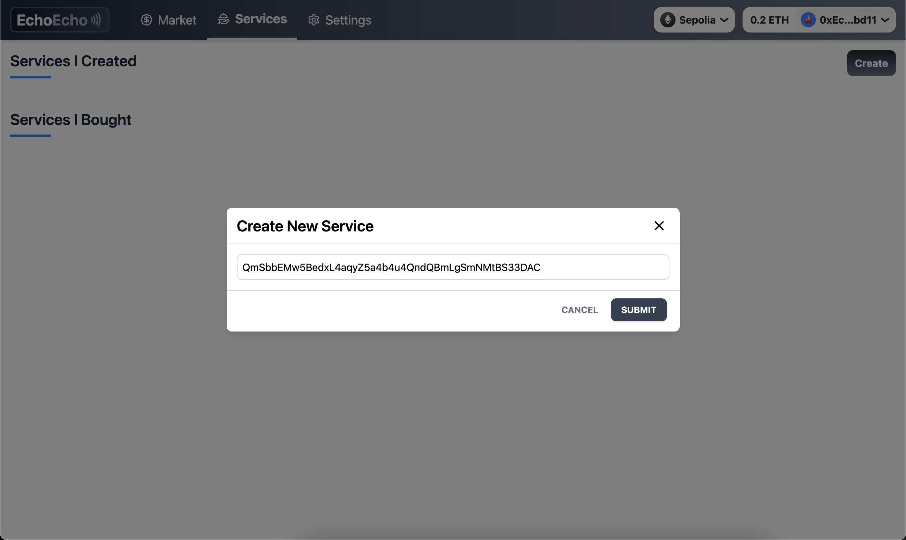
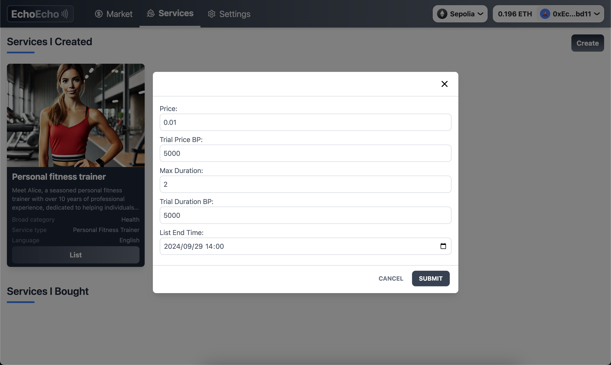
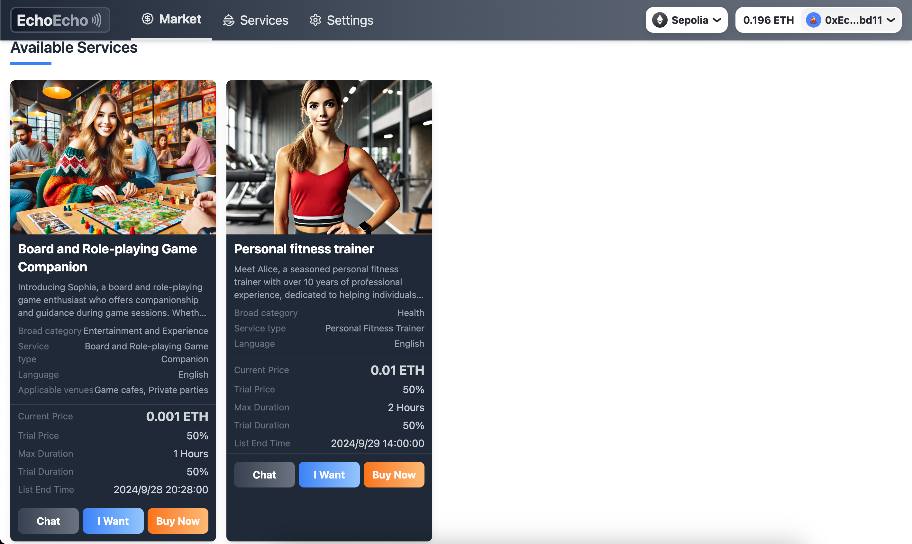
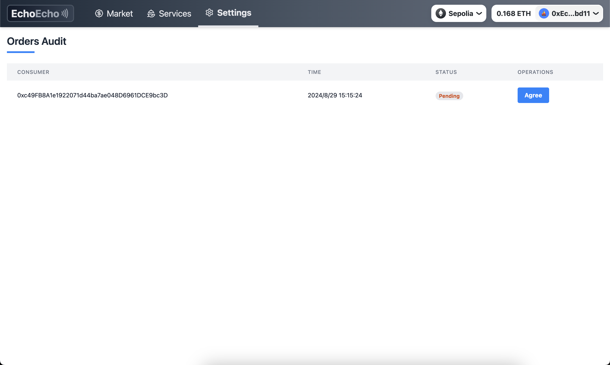
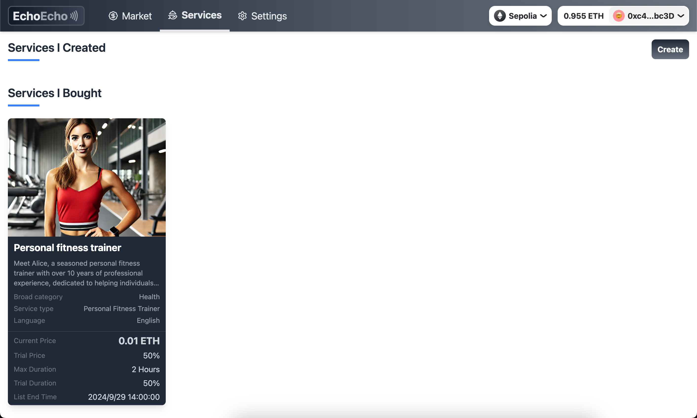

# 一. 项目概述
EchoEcho：一个基于NFT的线下服务平台。`service provider`可以在他想接单时，在平台更新他的地理坐标，`consumer`可以通过查看他附近NFT找到他需要的服务。

# 二. 技术栈
- `smart contract`：`Solidity`
- `frontend`：`Next.js`
- `zk proof`：`Circom + Snark.js`

# 三. 流程详情
1. **NFTMarket平台的手续费和试用政策**
    - **手续费**：NFTMarket平台在每次NFT交易中收取1%的手续费。
    - **试用时长和试用费用**：当`provider`上架他的NFT时，除了必要的信息外，还需要指定试用价格百分比（`trialPriceBP`）和试用时长百分比（`trialDurationBP`），即`consumer`在试用时长内取消订单，只需要支付试用价格即可。

2. **NFT的发行和上架（list_offline_service）**
    - **发行NFT**：
        - Maria是一位历史专业的学生，她痴迷于意大利历史地标和文化遗址，她可以凭借她艺术史背景和流利的意大利语，英语和印地语，提供独特的体验，将学习与休闲相结合，使每次旅行都令人难忘，那么她就可以将[Maria.json](https://github.com/TheEchoEcho/EchoEcho_contract/blob/main/IPFS_files/jsons/Maria_cultural_tour_guide.json)的IPFS CID值传到平台mint一个新的NFT。
        - Sophias是一位娱乐陪玩，不论是棋盘还是角色扮演游戏，她都能给出精妙的游戏技巧和美妙的游戏体验，那么她就可以将[Sophias.json](https://github.com/TheEchoEcho/EchoEcho_contract/blob/main/IPFS_files/jsons/Sophia_board&role-playing_game_companion.json)的IPFS CID值传到平台mint一个新的NFT。
        - Alice是一位经验丰富的私人健身教练，她希望不受地理位置的约束，每去一个新城市或国家时，都可以为当地人提供私教服务，那么她就可以将[Alice.json](https://github.com/TheEchoEcho/EchoEcho_contract/blob/main/IPFS_files/jsons/Alice_personal_fitness_trainer.json)的IPFS CID值传到平台mint一个新的NFT。
    - **定价和服务条款**：mint出的NFT可以上架到市场上供用户们选择，上架时需要填写一些必要的信息：
        - Price：一次服务的价格（单位：ETH）
        - Trial Price BP：试用价格（`5000 trial price besis points = 50% of the (price - fee)`）
        - Max Duration：一次服务的时长（单位：小时）
        - Trial Duration BP：试用时长（`5000 trial duration besis points = 50% of the max duration`）
        - List End Time：挂单的时间（如果Alice在一个新城市待一个月，那么这里的时间就可以选择一个月）
        - 
        - 市场就可以显示出该NFT：

3. **服务提供者的位置暴露和用户搜索**
    - **位置暴露**：Alice在接单时需在平台上公开其地理位置，以便用户可以根据距离搜索到她。
    - **用户搜索**：用户Bob想找私教，那么可以通过设置搜索条件（如距离、私教等）来找到符合条件的服务提供者。

4. **确认订单前的三种状态**
    - **consumer -> I Want**：Bob在找到Alice上架的NFT后，如果他想购买需要先点击`I Want`，平台会基于Bob的地理位置在Bob的本地生成一个`distance proof`，Alice可以在不知道Bob的具体位置的情况下知道他们之间距离多远，并且可以通过`distance proof`来验证这个距离是否是真实的；
    - **provider -> agree**：Alice查看了距离后，如果觉得可以接单，那么她就可以点击`agree`，她也可以进入`EchoEcho-chat`和Bob了聊天：
    - **consumer -> Buy Now**：当Alice `agree`之后，Bob就可以点击`Buy Now`，可以在Services中看到他已经买到服务。

5. **服务的执行和金钱托管**
    - **购买NFT**：Bob购买Alice的服务后，支付的ETH将被托管在平台的智能合约中；
    - **提款**：Alice只有在没有提供服务时取款，这是为了防止Bob在试用时长时取消订单。

## 3.2 其它
### 3.2.1 `zk proof`生成流程
- Bob在购买Alice的服务之前，需要向Alice提供一个证明，用以表示其在服务的提供范围之内。证明验证通过之后，才能开启后续服务步骤。证明以及验证的过程如下：
- $Prove(coord_1, coord_2, sig, pk, distance) -> \pi$ 。其中coord_2为用户的当前坐标，coord_1为服务的显示坐标。该证明表示coord_2距离coord_1小于distance，并且具有项目方的签名。
- $Verify(\pi, coord_1, sig, pk, distance) -> 1/0$ 。该函数输出1则表示验证通过，购买方确实在服务提供范围之内。
- 由于链上验证开销较大，而且在以上流程中必要性不高，验证过程也放在链下进行。

### 3.2.2 cancel order
- Bob可以在试用期间取消订单，那么平台会退款一部分金额给Bob(`amount = TrialPriceBP * (Price - fee)`)，Alice获得的金额为`Price - amount`。

# 四. 项目团队
- DylanJinx
- Pupil1999
- ymjrcc

