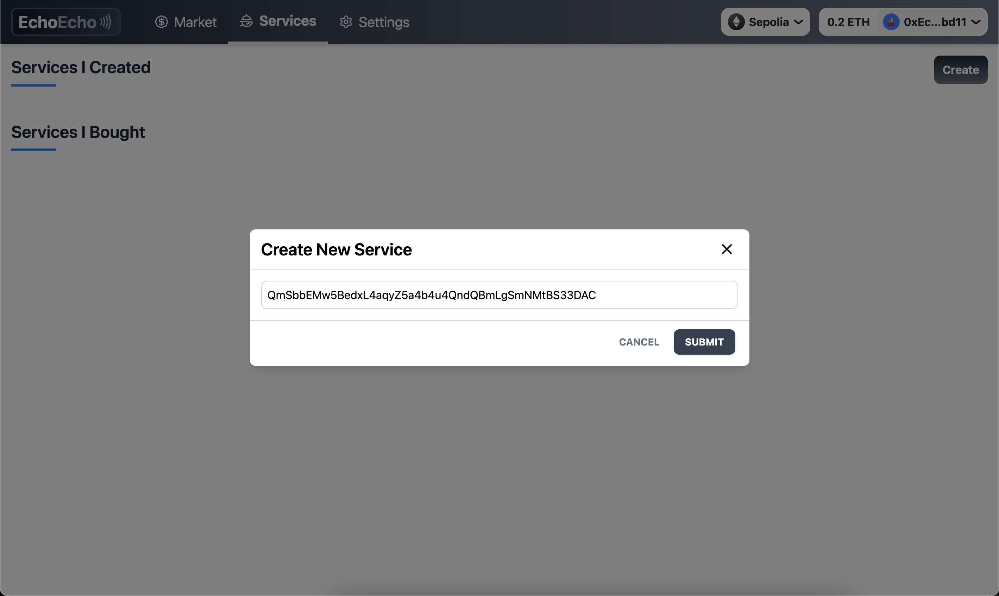

# 一. 项目概述
EchoEcho：一个基于NFT的线下服务平台。`service provider`可以在他想接单时，在平台更新他的地理坐标，`consumer`可以通过查看他附近NFT找到他需要的服务。

# 二. 技术栈
- 合约：`Solidity`
- 前端：`Next.js`
- `zk proof`：`circom + snark.js`

# 三. 流程详情
1. **NFTMarket平台的手续费和试用政策**
    - **手续费**：NFTMarket平台在每次NFT交易中收取1%的手续费。
    - **试用时长和试用费用**：当`provider`上架他的NFT时，除了必要的信息外，还需要指定试用价格百分比（`trialPriceBP`）和试用时长百分比（`trialDurationBP`），即`consumer`在试用时长内取消订单，只需要支付试用价格即可。

2. **NFT的发行和上架（list_offline_service）**
    - **发行NFT**：
        - Alice是一位经验丰富的私人健身教练，她希望不受地理位置的约束，每去一个新城市或国家时，都可以为当地人提供私教服务，那么她就可以将[Alice.json](https://github.com/TheEchoEcho/EchoEcho_contract/blob/main/IPFS_files/jsons/Alice_personal_fitness_trainer.json)的IPFS CID值传到平台mint一个新的NFT。
    - **定价和服务条款**：mint出的NFT可以上架到市场上供用户们选择，上架时需要填写一些必要的信息：

3. **服务提供者的位置暴露和用户搜索**
    - **位置暴露**：服务提供者Alice在接单时需在平台上公开其地理位置，以便用户可以根据距离搜索到她。
    - **用户搜索**：用户Bob想找陪玩玩王者荣耀，那么可以通过设置搜索条件（如距离、游戏类型等）来找到符合条件的服务提供者。

4. **交易的初始化和位置验证**
    - **发起交流**：Bob在找到Alice的ANFT后，可以发起聊天。
    - **位置验证**：如果Bob发起聊天，平台会在Bob本地生成zk proof（证明Bob与Alice的距离等于d），将zk proof和d发给Alice，Alice可以选择接单或不接单。

5. **服务的执行和金钱托管**
    - **购买NFT**：Bob决定购买Alice的服务后，支付的ETH将被托管在平台的智能合约中。
    - **服务开始**：Alice到达两者规定的地点后，在平台选择到达，平台会让Bob在一定时间内确认，如果Bob确认，开始计时服务。
    - **试用期与最低费用**：如果Bob在试用时长（服务时长的50%）内选择停止服务，平台将自动扣除最低费用0.5 ETH，剩余的金额退还给Bob。

6. **收益的分配**
    - **分账**：服务完成后，平台根据事先设定的比例分配收益，确保工会、Alice和平台各自的收益部分按约定分配。

### 3.2.1 `zk proof`生成流程
- 在Bob的本地生成 `zk proof`后，发送给Alice，无需生成可验证合约，只需Alice验证即可。
- 输入：用户坐标(x1, y1)，服务提供者坐标(x2, y2)，其中坐标有7位小数，前端需要将`坐标 * 1e7`后传入给zk电路。
    - 计算： $d = (x1 - x2)^2 + (y1 - y2)^2$ ，电路中同时要包括项目方对(x1, y1)的签名，私钥生成方式使用`(EchoEchoSigner, EchoEChoSignerPrivateKey) = makeAddrAndKey("EchoEchoSigner");`。
- 输出：距离d

# 四. 项目团队
- DylanJinx
- Pupil1999
- ymjrcc

